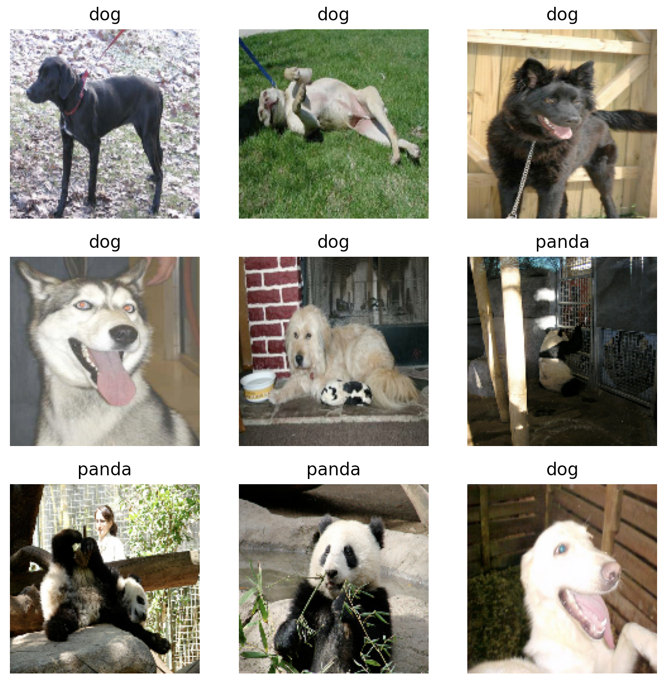
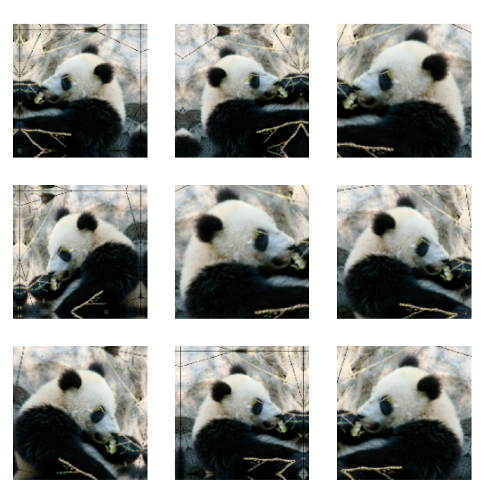
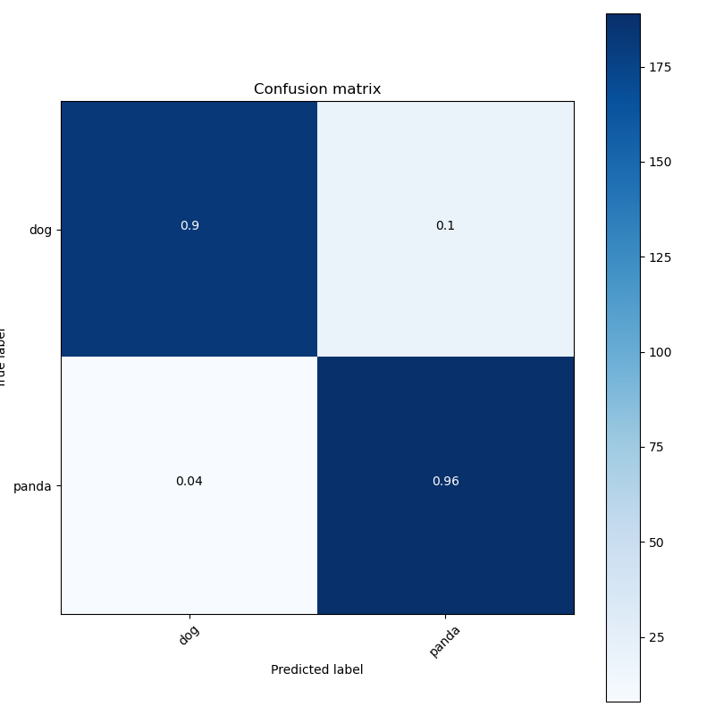
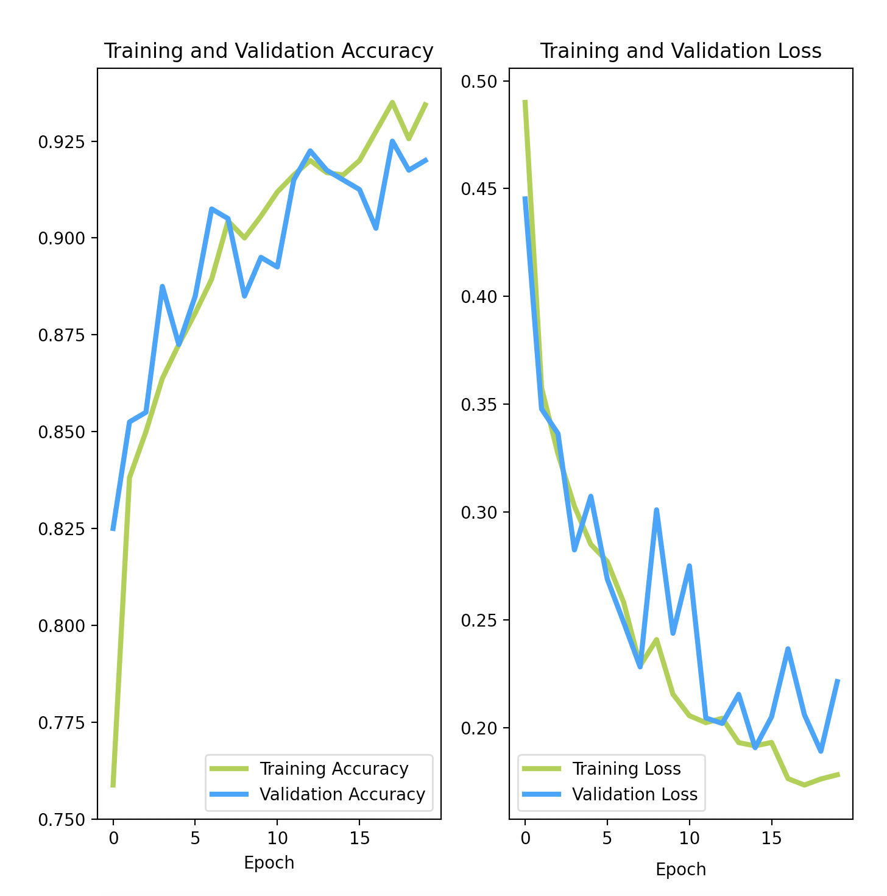
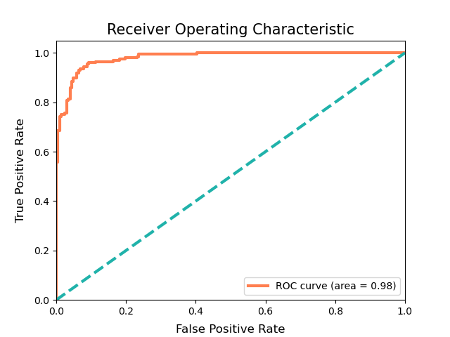
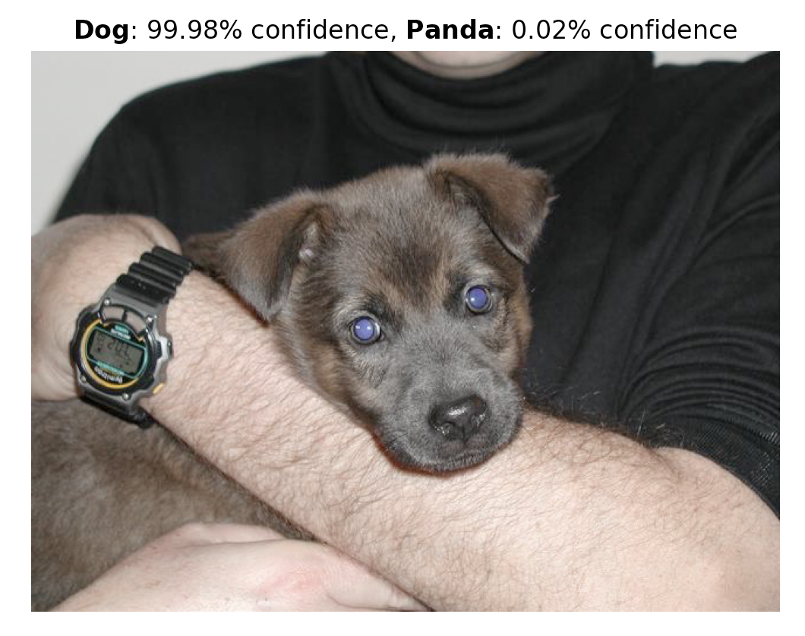
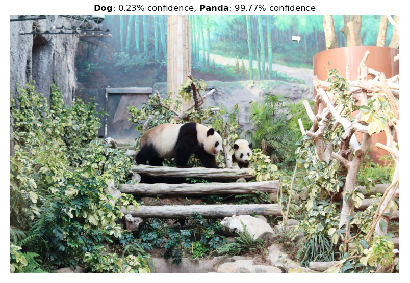
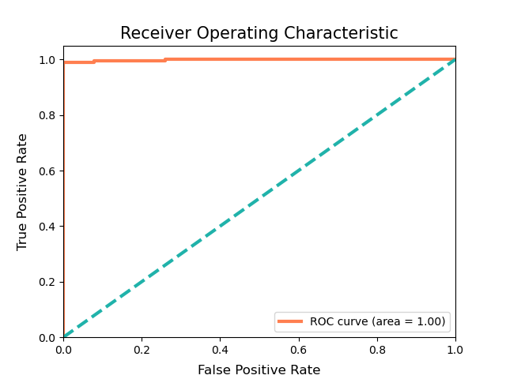

#  Dog 🐶 / Panda 🐼 - Image Classifier 
## Goal:
The aim of this project is to construct a Convolutional Neural Network binary image classifier capable of distinguishing between two classes of animals: dogs and pandas. The model can be applied to never before seen images of pandas and dogs for predictive purposes.

## Data Source:
The dog and panda images were downloaded from [Kaggle](https://www.kaggle.com/ashishsaxena2209/animal-image-datasetdog-cat-and-panda) and can be found in their respective 'animals' sub-directories. They should be isolated from the other, unnecessary, downloaded files and moved into a directory called 'animal_photos' in the project folder.

    animal_photos/
        dog/
            dogs_00001.jpg
            dogs_00002.jpg
            ...
        panda/
            panda_0001.jpg
            panda_0002.jpg
            ...

Rather than create training and validation subdirectories for each class and then use [ImageDataGenerator](https://www.tensorflow.org/api_docs/python/tf/keras/preprocessing/image/ImageDataGenerator), the training and validation datasets were created via the Keras utility [image_dataset_from_directory](https://www.tensorflow.org/api_docs/python/tf/keras/preprocessing/image_dataset_from_directory) with a 20% validation split.
- Training: 800 images per class
- Validation: 200 images per class 
- Size: All images resized to (150,150)

### Sample of Images from the Training Set

### To View Sample of Training Set: 
    python get_dataset_sample.py

## Model Architecture:
- Input Image Shape: (150,150,3)
- Rescaling and Augmentation
    - RGB channel values in the [0, 255] range are standardized to be between [0, 1] to speed up convergence
- Module 1:
    - Convolution operates on 3x3 windows and extracts 16 filters
    - Activation Function: ReLU
    - Maxpooling operates on 2x2 windows 
- Module 2:
    - Convolution operates on 3x3 windows and extracts 32 filters
    - Activation Function: ReLU
    - Maxpooling operates on 2x2 windows 
- Module 3:
    - Convolution operates on 3x3 windows and extracts 64 filters
    - Activation Function: ReLU
    - Maxpooling operates on 2x2 windows 
- Dropout rate determined via Keras Tuner
- Flatten feature map to 1D tensor
- First Fully Connected Layer:
    - Number of hidden units determined via Keras Tuner
    - Activation Function: ReLU
- Output Layer
    - Single Node
    - Activation Function: Sigmoid

### Hypertuning with the Keras Tuner
The optimal values for the following hyperparameters are found via the Keras Tuner:
1. Dropout rate 
2. The number of hidden units in the first fully connected layer 

## Image Augmentation:
Image augmentation is performed on training images via **TensorFlow 2.3** experimental preprocessing layers inside the CNN model. The types of augmentation applied:
- Horizontal flip
- Random rotation (up to 10%)
- Random zoom (up to 20%)

### Illustration of Augmentation Applied by the Model

### To View Augmentation Effects: 
    python get_augmented_sample.py

## Callbacks:
Three callbacks were utilized in training the model
- An early termination callback to prevent overfitting to the training data
- A TensorBoard callback to log basic metrics
- A LambdaCallback to log the confusion matrix at the end of each epoch

### Confusion Matrix from TensorBoard

- **Accuracy** (TP+TN / TP+FP+FN+TN): 93%
- **Precision** (TP / TP+FP): 95.7%
- **Recall** (TP / TP+FN): 90%
- **F1 Score** (2 x (recall x precision) / (recall+precision)): 92.8%

### To View in TensorBoard: 
    tensorboard --logdir logs/image

## Training and Validation Accuracy and Loss over 20 Epochs:

## ROC Curve: 

### To Train Model and Generate Graphs: 
    python train_model.py

## Prediction Examples:

### Predict Command: 
    python predict.py <ImageFileName>

## Transfer Learning:
Due to the limited number of available dog and panda images, we can achieve higher classification accuracy by leveraging features already learned by a network pre-trained on a larger dataset. 
- Architecture used: **MobileNet V2** (pre-trained on ImageNet)
- Accuracy reached: ~99%

### Transfer Learning Command
    python transfer_learning.py
